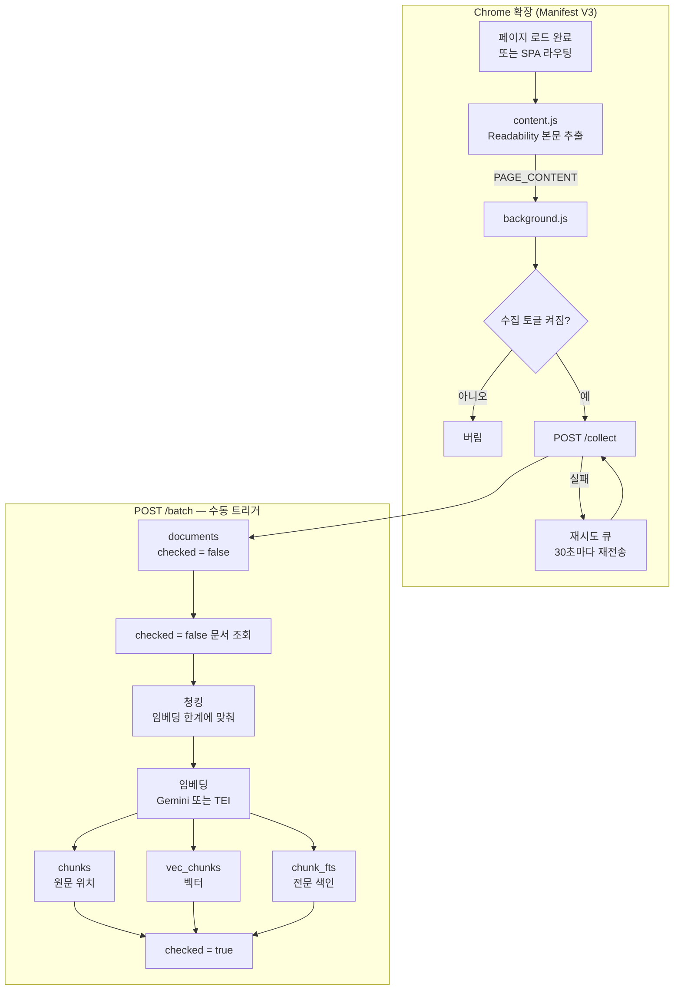
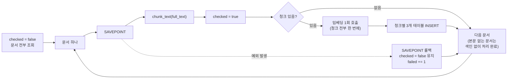
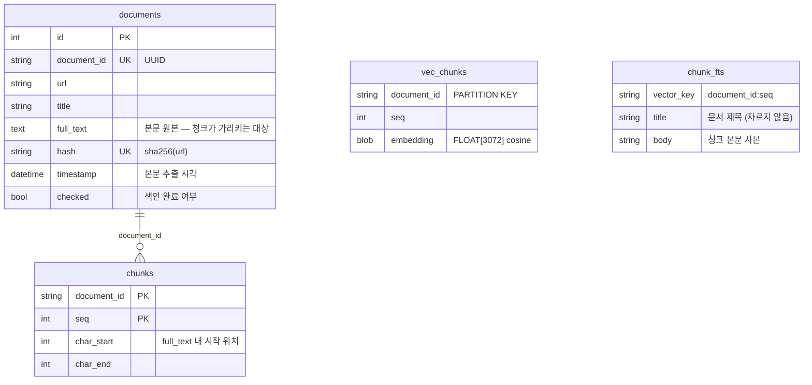

# 수집 · 색인 파이프라인

방문한 웹페이지가 어떻게 수집되어 검색 가능한 형태로 쌓이는지를 정리한 문서다.
검색(`/chat`) 쪽은 다루지 않는다.

관련 파일:

| 단계 | 파일 |
| --- | --- |
| 수집 · 전송 | `extension/background.js` |
| 본문 추출 | `extension/content.js` (+ `extension/Readability.js`) |
| 수신 · 저장 | `api/routes/collect.py`, `services/document.py`, `models/document.py` |
| 색인 | `api/routes/batch.py`, `services/indexing.py`, `services/chunking.py`, `services/embedding.py` |
| 테이블 생성 | `db/init_db.py` |
| 색인 트리거 UI | `frontend/src/hooks/useBatch.ts`, `frontend/src/components/chat/BatchControl.tsx` |

## 한눈에 보기



핵심은 **수집과 색인이 분리되어 있다**는 점이다. 수집은 페이지를 볼 때마다 실시간으로
일어나지만, 색인은 임베딩 API 호출 비용이 있어 미처리 문서를 모아 배치로 처리한다.
그래서 `documents`에 들어온 문서는 곧바로 검색되지 않고, `/batch`를 한 번 돌려야 검색 대상이 된다.

---

## 1단계 — 수집 트리거와 전송 (`background.js`)

### 트리거는 하나뿐이다

background가 하는 일은 **`content.js`가 보낸 `PAGE_CONTENT`를 받아 그대로 POST하는 것**뿐이다.
브라우저 이벤트를 보고 "지금 보고 있는 페이지"를 판정하지 않는다.

```
PAGE_CONTENT 도착
   │
   ├─ url 이 http/https 아님        →  버림
   ├─ 수집 토글 꺼짐 (trackingEnabled) →  버림
   └─ 그 외                         →  POST /collect
```

조건이 이 둘뿐이라 **열린 페이지는 전부 수집된다.** 배경 탭에서 로드된 페이지, 포커스가
없는 창의 페이지도 들어온다. 뒤집어 말하면 링크를 새 탭으로 열어두기만 하고 보지 않은
페이지도 기록에 남는다. 로컬 검색용 아카이브라 놓치는 쪽보다 더 모으는 쪽을 택한 결과다.

토글은 전역 변수에 캐시하지 않고 쓸 때마다 `storage.local`에서 읽는다. Manifest V3
서비스워커는 유휴 시 종료되고 메시지가 오면 다시 깨어나는데, 캐시해 두면 깨어난 직후
초기화가 끝나기 전에 도착한 메시지가 기본값(켜짐)으로 처리된다.

| 이벤트 | 리스너 | 하는 일 |
| --- | --- | --- |
| 본문 도착 | `runtime.onMessage` (`PAGE_CONTENT`) | 검사 후 즉시 전송 |
| SPA 라우팅 | `webNavigation.onHistoryStateUpdated` | 800ms 뒤 본문 재추출 요청 |
| 재시도 알람 | `alarms.onAlarm` | 실패 큐 재전송 |
| 설치/업데이트 | `runtime.onInstalled` | 기본값 채우기, 폐기된 키 정리 |

### 왜 방문이 끝날 때가 아니라 시작할 때 보내는가

이전 구조는 방문 세션을 하나 유지하면서 본문을 세션 객체에 담아두고, 방문이 끝나는
시점(탭 전환·포커스 이동·idle 진입·탭 닫힘)에 체류시간과 함께 전송했다. 이 구조에는
본문이 조용히 사라지는 경로가 여러 개 있었다.

- 본문을 세션에 붙일 때 `(tabId, url)`을 엄격히 비교했다. 페이지가 `history.replaceState`로
  추적 파라미터를 정리하거나 리다이렉트가 끼면 URL이 어긋나 본문이 폐기됐다.
- 새 세션을 열기 전에 이전 세션의 전송(`fetch`)을 `await` 했다. 서버가 느리면 그 사이 도착한
  본문이 아직 열리지 않은 세션을 만나 폐기됐다.
- 제목 갱신 핸들러와 본문 핸들러가 같은 세션 객체를 각자 읽고 썼다. 순서가 엇갈리면
  제목 쓰기가 본문을 덮었다.
- 로드가 느린 페이지를 먼저 떠나면 본문 없이 전송됐고, 브라우저를 그냥 종료하면 방문 자체가
  통째로 유실됐다.

체류시간을 쓰지 않기로 하면서 방문 종료 시점을 붙잡을 이유가 없어졌고, 본문을 들고 있는
구간이 사라져 위 경로가 전부 없어졌다. `computeQualifyingTab`·`refreshSession`·
`finalizeSession`과 `storage.session` 상태, `idle`/`tabs` 권한도 함께 걷어냈다.

### 전송과 재시도

받은 본문은 **그 즉시** POST 한다. 주기 배치가 아니다.

```json
POST {apiEndpoint}/collect
{
  "url":       "https://example.com/article",
  "title":     "페이지 제목",
  "startTime": "2026-08-24T12:00:00.000Z",
  "content":   "추출된 본문 텍스트 …"
}
```

`startTime`은 본문을 추출해 전송한 시각이다. 체류시간은 재지 않으므로 `endTime`도 없다.

전송이 실패하면(오프라인, 서버 다운) 그 레코드만 `chrome.storage.local`의 `queue`에 쌓고,
`chrome.alarms`로 **30초마다** 큐 전체를 다시 시도한다. 성공한 건은 큐에 들어가지 않고,
재시도에서 성공한 건만 그때그때 큐에서 빠진다 — 큐를 미리 비워두고 돌리면 도중에
서비스워커가 종료될 때 아직 못 보낸 건까지 함께 사라진다.

큐는 storage 를 읽고 고쳐 다시 쓰는 방식이라 여러 페이지가 동시에 실패하면 서로의 쓰기를
덮어쓴다. 전송이 페이지 단위로 병렬이 된 지금은 실제로 부딪히므로 큐에 손대는 구간만
프라미스 체인으로 직렬화한다. 항목 수는 **300건**으로 제한하고 넘치면 오래된 것부터
버린다 — 항목마다 본문 전체가 들어가서, 서버를 꺼둔 채로 오래 브라우징하면
`storage.local` 용량(확장 기본 약 10MB)을 넘겨 저장 자체가 실패한다.

---

## 2단계 — 본문 추출 (`content.js`)

모든 URL에 `Readability.js` + `content.js`가 `document_idle` 시점에 주입된다.

```
document 복제
   │
   ├─ Mozilla Readability 로 파싱 → article.textContent
   │        (광고 · 내비게이션 · 사이드바 제거된 기사 본문)
   │
   └─ 파싱 실패 / 빈 결과 → document.body.innerText 로 폴백
   ▼
연속 공백(\s+)을 공백 한 칸으로 접고 trim
   ▼
직전 전송분과 (url, 본문)이 같으면 여기서 중단
   ▼
runtime.sendMessage({ type: 'PAGE_CONTENT', url, title, text })
```

추출 시점은 `window.load` 이후다(`document_idle`에 주입되므로 대개 이미 지나 있다). background가
본문을 들고 있지 않고 받는 즉시 보내므로, 로드가 늦어도 방문을 먼저 떠났다고 본문이
버려지지는 않는다. 다만 로드가 끝나지 않는 페이지는 아예 수집되지 않는다.

SPA(`history.pushState`) 라우팅은 실제 문서 로드가 아니라서 콘텐츠 스크립트가 다시 주입되지
않는다. 그래서 라우팅을 감지하면 800ms 뒤에 `REQUEST_CONTENT`를 보내 재추출을 요청한다.
렌더링이 800ms보다 늦게 끝나는 페이지는 이전 화면의 본문이 잡힐 수 있다.

한 문서에서 여러 번 보낼 수 있게 되었으므로(초기 로드 + 재추출 요청) 직전에 보낸
`(url, 본문)`을 기억해두고 같은 내용이면 보내지 않는다. 서버도 URL 해시로 중복을 걸러내지만
굳이 왕복할 필요가 없다.

> **주의**: 이 단계에서 개행까지 공백으로 접히기 때문에, 저장되는 `full_text`에는 `\n`이 없다.
> 뒤의 청킹이 개행 경계를 찾도록 되어 있지만 실제로는 걸릴 개행이 없어 글자 수 하드 컷으로
> 동작한다. 아래 [청킹](#청킹) 참고.

---

## 3단계 — 수신과 저장 (`POST /collect`)

라우트가 하는 일은 검증과 저장 호출뿐이다. 응답은 항상 `{"status": "ok"}`로, 새로 저장됐는지
중복으로 무시됐는지 구분하지 않는다.

### 중복 제거

같은 페이지를 여러 번 방문하면 매번 `/collect`가 불린다. 이를 걸러내는 키가 `hash`다.

```
hash = SHA-256(url)

INSERT INTO documents (...) VALUES (...)
  ON CONFLICT (hash) DO NOTHING
```

**URL 하나가 문서 하나다.** 본문은 해시에 넣지 않는다. 예전에는 `sha256(url + content)`였는데,
그러면 같은 URL을 다시 방문할 때마다 새 문서가 쌓였다. 광고·추천 목록·조회수처럼 본문 추출에
딸려 들어오는 자리가 방문마다 조금씩 달라서, 실제로는 같은 페이지인데 검색 결과를 여러 행이
나눠 차지했다. 구글 검색결과 한 페이지가 본문 878자와 894자 차이로 네 행이 된 식이다.

그 대가로 **처음 수집한 본문이 그대로 굳는다.**

- 내용이 갱신된 기사를 다시 방문해도 예전 본문이 남는다.
- 첫 수집이 빈 본문이었다면(iframe 사이트, 로그인 페이지 등) 그 URL은 계속 빈 채로 남아
  검색에 걸리지 않는다.

최신 본문으로 덮어쓰려면 `full_text`가 바뀌는 순간 이미 쌓인 그 문서의 청크·벡터·전문 색인이
가리키는 위치가 어긋나므로, 문서 단위로 색인을 버리고 `checked`를 되돌려야 한다. 로컬 검색용
아카이브에서 그만한 값이 없다고 보고 택하지 않았다.

URL 정규화는 하지 않는다. `#` 프래그먼트나 `utm_*` 같은 추적 파라미터가 붙으면 같은 페이지도
다른 URL로 취급되어 별개 행이 된다.

### 옛 해시 정리 (`db/init_db.py`)

이미 쌓인 행은 옛 해시를 들고 있어서, 그냥 두면 같은 URL이 새 방식으로 한 번 더 들어온다.
`hash`에 unique 제약이 걸려 있으므로 재계산 전에 URL 중복부터 정리한다.

```
URL 중복 중 가장 오래된 행만 남김  (재방문분을 무시하는 것과 같은 규칙)
   ▼
지워지는 문서의 chunks · vec_chunks · chunk_fts 도 함께 삭제
   ▼
남은 행 전부 hash = SHA-256(url) 로 UPDATE
   ▼
app_settings['documents_hash_scheme'] = 'url'  (다음 기동부터 건너뜀)
```

`documents` 전체를 훑는 작업이라 표시를 남겨 한 번만 돌린다. 마이그레이션 도구가 없어
`_ensure_column`과 같은 자리에서 처리한다.

### 저장되는 것 / 안 되는 것

| 요청 필드 | 저장 위치 |
| --- | --- |
| `url` | `documents.url` |
| `title` | `documents.title` |
| `content` | `documents.full_text` |
| `startTime` | `documents.timestamp` |

체류시간은 수집하지 않으므로 "오래 본 페이지 위주로 찾기" 같은 건 지금 구조로는 불가능하다.
확장이 `deviceId`를 만들어 두기는 하지만 전송 레코드에 실리지 않아 기기 구분도 없다.

`documents.timestamp`는 "어제 본 글" 같은 기간 검색의 기준이기도 하다([query-flow.md](query-flow.md)).
이미 있는 URL은 무시하고 새 행을 만들지 않으므로 이 값은 **처음 수집한 때로 굳는다** — 재방문은
기간 검색에 반영되지 않는다.

구버전 확장의 재시도 큐에 남아 나중에 올라오는 레코드는 `endTime`을 싣고 있는데, pydantic이
스키마에 없는 필드를 무시하므로 그대로 받아들여진다.

행이 만들어질 때 `document_id`(UUID)가 붙고 `checked`는 `false`로 들어간다. 이 `checked`가
색인 대기 표시다.

---

## 4단계 — 색인 (`POST /batch`)

자동 실행되지 않는다. 프론트엔드 화면의 색인 버튼(`BatchControl` → `useBatch` → `/api/batch`)
또는 직접 호출로 돈다. 색인이 오래 걸리는 동안 버튼을 여러 번 눌러도 요청이 겹치지 않게
프론트에서 막아둔다.



### 청킹

`services/chunking.py`. 청크 하나의 크기는 **지금 쓰는 임베딩의 입력 한계에서 자동으로 정해진다**
(`core.model_catalog.chunk_chars_for`). 설정 항목이 아니다.

| 임베딩 | 입력 한계 | 청크 크기 |
| --- | --- | --- |
| `gemini-embedding-001` | 2048 토큰 | 2252자 |
| `gemini-embedding-2` | 8192 토큰 | 9011자 |
| TEI | `/info`의 `max_input_length` | 그 값 × 1.1 |

한계를 넘겨 보내면 오류가 나는 대신 **뒷부분이 조용히 버려진다**(Gemini도, `auto_truncate`가 기본인
TEI도 그렇다). 그래서 넘치지 않는 쪽으로 보수적으로 잡는다 — 토크나이저를 로컬에서 돌릴 수 없어
글자 수로 근사하는데, 한국어는 1.22~3.89 자/토큰이라 가장 촘촘한 경우(1토큰 = 1.1자)를 기준으로
환산한다. 영어 기준(3~4자/토큰)으로 잡으면 한국어 문서의 뒤가 잘려 나간다.

### 제목이 쓰는 몫

위 표의 값은 **임베딩에 들어가는 문자열 전체**의 한계다. 그런데 실제로 보내는 것은 청크만이
아니라 `f"{제목}\n{청크}"` 라서(아래 [임베딩](#임베딩) 참고), 청크를 표의 값까지 꽉 채워 자르면
제목과 개행만큼 한계를 넘는다. 위에서 본 대로 넘친 뒷부분은 오류 없이 버려진다.

```
services.indexing.split_embedding_budget

청크 문자 수 = max_chars - len(제목) - 1
제목         = 앞에서 max_chars × 0.25 까지만 (그보다 길면 잘라서 임베딩)
```

`max_chars` 자체가 최악의 문자/토큰 비율로 환산된 값이라 여유가 거의 없다 —
`gemini-embedding-001`의 2252자는 1.11자/토큰인 문서에서 이미 2029토큰으로 한계 2048에
닿는다. 제목 몫을 빼두지 않으면 한국어 밀도가 높은 문서에서 청크 끝이 제목 길이만큼 잘렸다.

제목 몫에 상한(25%)을 두는 것은 제목이 비정상적으로 긴 문서에서 본문에 남는 자리가 거의 없어
청크가 잘게 쪼개지는 것을 막기 위한 것이다.

```
        0          청크 문자 수        ×2
full_text ├──────────────┼──────────────┼──────┤
          │  청크 0      │  청크 1      │ 청크2 │
          └─ char_start/char_end 로 위치만 기록
```

색인 배치는 이 값을 매번 다시 계산하지 않고 색인 상태에 기록된 값(`indexed_chunk_chars`)을 쓴다.
값을 정하는 것은 재색인(`POST /reindex`)이다 — 배치마다 다시 물으면 같은 색인 안에 경계가 다른
청크가 섞인다.

원래 의도는 그 길이 안에서 마지막 개행(`rfind("\n")`)까지만 잘라 문장이 토막나지 않게 하는
것이다. 하지만 앞서 본 대로 본문 추출 단계에서 개행이 공백으로 접히므로 실제 저장된
`full_text`에는 개행이 없고, 결과적으로 **정확히 그 길이마다 끊긴다**. 개행 경계 로직을
살리려면 `content.js`의 `replace(/\s+/g, ' ')`가 개행을 남기도록 바꿔야 한다.

청크는 겹치지 않는다(overlap 0). 경계에 걸친 문맥은 두 청크로 갈린다.

### 임베딩

```python
title, chunk_chars = split_embedding_budget(document.title, max_chars)
chunks = chunk_text(document.full_text, max_chars=chunk_chars)
embed_texts([f"{title}\n{chunk.text}" for chunk in chunks])
```

- 한 문서의 모든 청크를 **한 번의 API 호출**로 임베딩한다. 청크가 많은 문서일수록 이득이 크다.
- 각 청크 앞에 **문서 제목을 붙여서** 임베딩한다. 본문 중간 청크만 떼어놓으면 무슨 글의
  일부인지 알 수 없어, 제목이 그 맥락을 준다. 제목이 차지하는 자리는 청킹 단계에서 미리
  빼둔다([제목이 쓰는 몫](#제목이-쓰는-몫)).
- 임베딩을 어디서 받는지는 설정이 정한다(설정 화면의 '제공자', 기본은 Gemini).
  - **Gemini** — 모델 `EMBEDDING_MODEL`(기본 `gemini-embedding-001`), 차원 `EMBEDDING_DIM`(기본
    `3072`), `task_type="RETRIEVAL_DOCUMENT"`. 검색 질의 쪽은 `RETRIEVAL_QUERY`로 다르게 임베딩한다.
  - **TEI** — 자체 호스팅 서버의 OpenAI 호환 경로(`POST /v1/embeddings`)로 보낸다. 차원은 서버에
    올린 모델이 정하고, `task_type`에 해당하는 개념이 없어 문서와 질의를 같은 방식으로 보낸다.
    청크는 32개씩 잘라 보낸다(TEI의 `--max-client-batch-size` 기본값).
- 제공자나 모델을 바꾸면 이미 쌓인 벡터는 다른 공간의 좌표가 되어 쓸 수 없다. `POST /reindex`로
  색인을 비우고 다시 쌓아야 하며, 그 전까지 검색은 벡터 쪽을 건너뛴다. 자세한 내용은
  [README의 임베딩 제공자](../README.md#6-임베딩-제공자-gemini-또는-tei)를 참고한다.
- 전문 색인(`chunk_fts`)에는 제목을 **별도 열로** 넣는다. 한 열에 합치면 제목과 본문을 구별해
  가중치를 줄 수 없고, 제목이 그 문서의 모든 청크 행에 반복 색인되어 제목 단어의 IDF가
  희석된다. 이쪽 제목은 자르지 않는다 — 길이를 줄이는 것은 임베딩 입력 한계 때문이고 FTS에는
  그런 한계가 없다.

### 세 테이블에 나눠 쓰기

청크 하나가 세 곳에 나뉘어 들어간다.

```
                    청크 (document_id=D, seq=1)
                              │
      ┌───────────────────────┼────────────────────────┐
      ▼                       ▼                        ▼
  chunks                  vec_chunks               chunk_fts
  (일반 테이블)            (vec0 가상)               (FTS5 가상)

  document_id  = D        document_id = D          vector_key = "D:1"
  seq          = 1        seq         = 1          title      = 문서 제목
  char_start   = 8192     embedding   = float32[3072]  body   = 청크 본문
  char_end     = 16384

  → 원문 위치만            → 벡터 검색용             → 전문 검색용
    본문 사본 없음           cosine 거리               제목 + 본문 사본
```

`chunks`가 본문을 복사해 두지 않고 `char_start`/`char_end`로 `documents.full_text`를 가리키는
이유는 같은 텍스트를 두 번 저장하지 않기 위해서다. 전문 검색은 색인할 실제 텍스트가 필요하므로
`chunk_fts`에만 사본이 들어간다.

가상 테이블은 SQLAlchemy 모델이 아니라 원시 DDL로 만든다(`db/init_db.py`, 첫 서버 실행 시 자동).

```sql
CREATE VIRTUAL TABLE IF NOT EXISTS vec_chunks USING vec0(
    document_id TEXT PARTITION KEY,
    seq INTEGER,
    embedding FLOAT[3072] distance_metric=cosine
);

CREATE VIRTUAL TABLE IF NOT EXISTS chunk_fts USING fts5(
    vector_key UNINDEXED,
    title,
    body
);
```

가상 테이블에는 열을 더하는 `ALTER`가 없다. 그래서 `chunk_fts`의 열이 위 DDL과 다르면
`init_db._ensure_chunk_fts_columns`가 테이블을 지우고 다시 만든다. 본문의 사본이라 버려도
잃는 것은 없지만 **다시 채우는 것은 재색인**(`POST /reindex` → `POST /batch`)이다 —
이미 `checked = true`인 문서는 배치가 건너뛴다. 그때까지 전문 검색은 빈 테이블을 보고
벡터 검색만 결과를 낸다.

`document_id`를 파티션 키로 두면 벡터 검색이 문서 단위로 쪼개져 탐색된다. `vector_key`는
`"{document_id}:{seq}"` 형태의 문자열로, FTS 결과를 다시 청크로 되돌리는 유일한 연결고리다.
`DATABASE_URL`이 SQLite가 아니면 이 두 테이블은 아예 생성되지 않는다.

### 실패 처리

문서 하나마다 savepoint(`db.begin_nested()`)를 잡는다. 한 문서의 임베딩이 실패하면 그 문서의
부분 삽입만 되돌려지고 `checked`는 `false`로 남아 **다음 배치에서 다시 시도된다**. 나머지
문서는 그대로 커밋된다. 응답은 그 실행의 집계다.

```json
{ "attempted": 12, "succeeded": 11, "failed": 1 }
```

`checked = true`는 청크가 있든 없든 세팅한다. 본문이 비어 있는 문서(추출 실패, SPA 타이밍
문제 등)는 청크가 0개라 임베딩 호출 없이 처리 완료로 넘어간다. `documents`에는 남아 있지만
검색으로는 절대 걸리지 않는 문서가 되는 셈이다.

---

## 쌓인 데이터의 모양



`vec_chunks`와 `chunk_fts`는 가상 테이블이라 FK가 없다. `(document_id, seq)`와 `vector_key`
문자열이 논리적 연결의 전부이고, 정합성은 색인 코드가 세 곳을 같은 savepoint 안에서 함께
쓰는 것으로만 지켜진다.

## 단계별 유실 지점 정리

데이터가 어디서 사라질 수 있는지 한자리에 모았다.

| 단계 | 조건 | 결과 |
| --- | --- | --- |
| 수집 | 수집 토글 끔 | 버림 |
| 수집 | http/https 아닌 URL | 버림 |
| 수집 | 시크릿 모드에서 "허용"을 켜지 않음 | 수집 안 됨 |
| 본문 추출 | `window.load`가 끝나지 않는 페이지 | 수집 안 됨 |
| 본문 추출 | 본문이 iframe 안에 있음 (메인 프레임만 주입) | `content: ""`로 전송 |
| 본문 추출 | Readability 실패 + `body.innerText`도 빈약 | 본문이 빈약하게 전송 |
| 본문 추출 | SPA 렌더링이 800ms보다 늦음 | 이전 화면 본문이 실릴 수 있음 |
| 전송 | 서버 다운 · 오프라인 | 재시도 큐에 남아 30초마다 재시도 |
| 전송 | 재시도 큐가 300건 초과 | 오래된 건부터 버림 |
| 저장 | 이미 있는 URL | 무시(중복) — 본문이 달라져도 갱신되지 않음 |
| 색인 | `/batch`를 돌리지 않음 | 검색되지 않음 |
| 색인 | 본문이 비어 있음 | 청크 0개, 검색되지 않음 |
| 색인 | 임베딩 실패 | 롤백 후 다음 배치에서 재시도 |

## 관련 문서

- [`README.md`](../README.md) — 전체 구성, 환경변수, 검색 흐름
- [`extension/README.md`](../extension/README.md) — 확장 설치와 설정
- [`query-flow.md`](query-flow.md) — 쌓인 데이터를 질문으로 되찾는 흐름
- [`conversations-api.md`](conversations-api.md) — 대화 세션 API
