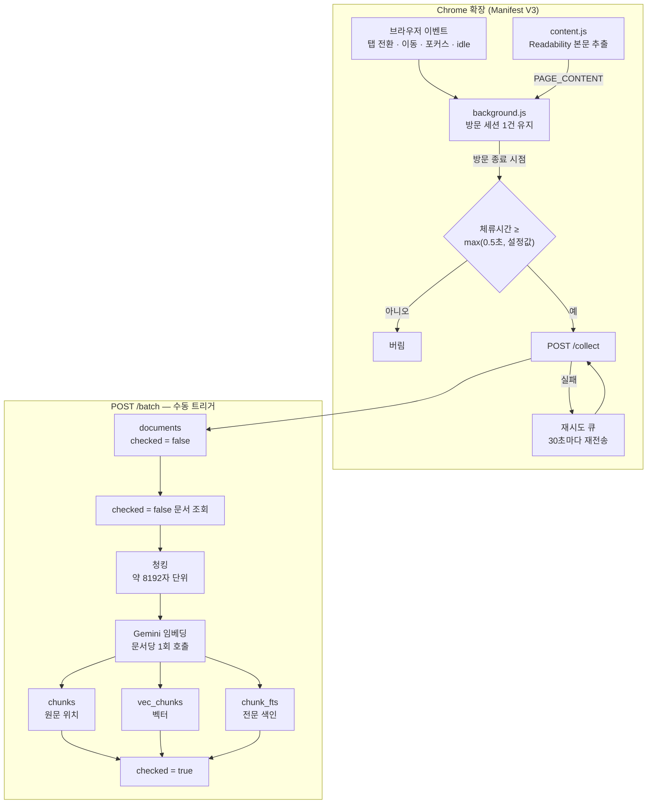
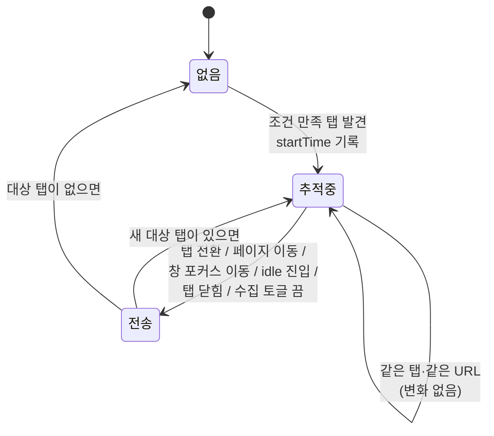
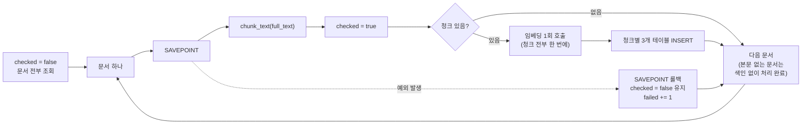
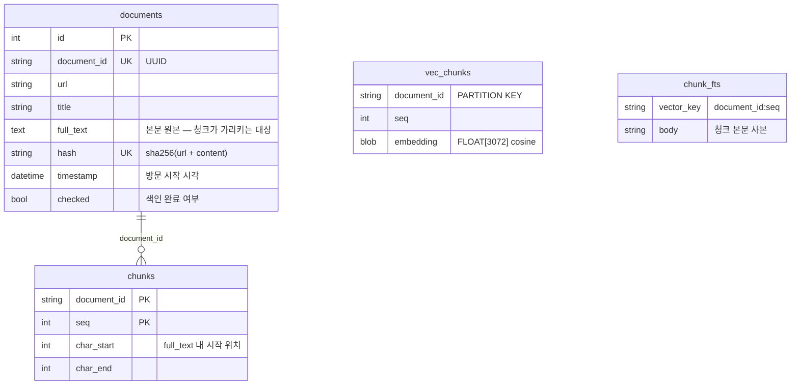

# 수집 · 색인 파이프라인

방문한 웹페이지가 어떻게 수집되어 검색 가능한 형태로 쌓이는지를 정리한 문서다.
검색(`/chat`) 쪽은 다루지 않는다.

관련 파일:

| 단계 | 파일 |
| --- | --- |
| 방문 감지 · 전송 | `extension/background.js`, `extension/dwell.js` |
| 본문 추출 | `extension/content.js` (+ `extension/Readability.js`) |
| 수신 · 저장 | `api/routes/collect.py`, `services/document.py`, `models/document.py` |
| 색인 | `api/routes/batch.py`, `services/indexing.py`, `services/chunking.py`, `services/embedding.py` |
| 테이블 생성 | `db/init_db.py` |
| 색인 트리거 UI | `frontend/src/hooks/useBatch.ts`, `frontend/src/components/chat/BatchControl.tsx` |

## 한눈에 보기



핵심은 **수집과 색인이 분리되어 있다**는 점이다. 수집은 페이지를 볼 때마다 실시간으로
일어나지만, 색인은 임베딩 API 호출 비용이 있어 미처리 문서를 모아 배치로 처리한다.
그래서 `documents`에 들어온 문서는 곧바로 검색되지 않고, `/batch`를 한 번 돌려야 검색 대상이 된다.

---

## 1단계 — 방문 감지 (`background.js`)

### 어느 페이지를 "보고 있는 중"으로 볼 것인가

확장은 **전역에 방문 세션 딱 하나**만 유지한다. 열려 있는 탭이 몇 개든, 세 조건을 모두 만족하는
탭 하나만 추적한다(`computeQualifyingTab`).

```
수집 토글이 켜져 있고 (trackingEnabled)
        ∧  사용자가 idle 상태가 아니고 (idle.queryState === 'active', 감지 간격 60초)
        ∧  포커스된 일반 창이 있으며 (windows.WINDOW_ID_NONE 아님)
        →  그 창의 활성 탭이 URL 이 http/https 이면 추적 대상
```

배경 탭에서 도는 페이지, 창을 내려둔 동안, 자리를 비운 동안은 세션이 열리지 않는다. 즉
기록되는 시간은 "탭이 열려 있던 시간"이 아니라 **실제로 화면에 두고 보던 시간**에 가깝다.

세션 상태는 `chrome.storage.session`에 둔다. Manifest V3 서비스워커는 유휴 시 종료되고
필요할 때 다시 깨어나므로, 전역 변수에 두면 진행 중이던 방문이 사라진다.

### 세션 전이

아래 이벤트가 오면 전부 `refreshSession()` 하나로 모인다. 대상 탭이 직전 세션과
`(tabId, url)`이 같으면 아무 일도 일어나지 않고, 다르면 **기존 세션을 끝내고(전송) 새 세션을 연다**.



| 이벤트 | 리스너 | 하는 일 |
| --- | --- | --- |
| 페이지 이동 | `webNavigation.onCommitted` (메인 프레임만) | 세션 교체 |
| SPA 라우팅 | `webNavigation.onHistoryStateUpdated` | 세션 교체 + 800ms 뒤 본문 재추출 요청 |
| 탭 전환 | `tabs.onActivated` | 세션 교체 |
| 창 포커스 변경 | `windows.onFocusChanged` | 세션 교체 또는 종료 |
| idle 진입/복귀 | `idle.onStateChanged` | 세션 종료 또는 시작 |
| 탭 닫힘 | `tabs.onRemoved` | 그 탭의 세션이면 종료 |
| 제목 확정 | `tabs.onUpdated` | 세션의 `title` 갱신 |
| 수집 토글 | `storage.onChanged` | 끄는 즉시 진행 중 세션 종료 |

제목을 `onUpdated`에서 따로 잡는 이유는 `onCommitted` 시점엔 아직 제목이 비어 있는 경우가
많기 때문이다. 이때 `session.url === tab.url` 확인이 반드시 필요하다 — 같은 탭에서 다음
페이지로 넘어간 뒤 도착한 제목이 아직 안 닫힌 이전 세션에 들어가면, 전송 레코드의 제목과
URL이 서로 다른 페이지를 가리키게 된다.

### 체류시간 필터

세션이 끝나면(`finalizeSession`) 먼저 체류시간을 본다.

```
duration = endTime - startTime
threshold = max(500ms, minDwellSeconds × 1000)

duration < threshold  →  전송하지 않고 버림
```

`minDwellSeconds`는 사용자가 옵션 페이지에서 정한다(기본 `0` = 필터 없음). 설정과 무관하게
**0.5초 미만은 항상 버린다** — 탭을 훑고 지나갈 때 생기는 튐이라 기록할 가치가 없다.
값은 초 단위로 저장하고, 초 단위 지원 이전 버전이 쓰던 `minDwellMinutes`는 설치 시점에
초로 환산해 옮긴다(`dwell.js`).

### 전송과 재시도

임계값을 넘긴 방문은 **그 즉시** POST 한다. 주기 배치가 아니다.

```json
POST {apiEndpoint}/collect
{
  "url":       "https://example.com/article",
  "title":     "페이지 제목",
  "startTime": "2026-08-13T12:00:00.000Z",
  "endTime":   "2026-08-13T12:03:20.000Z",
  "content":   "추출된 본문 텍스트 …"
}
```

전송이 실패하면(오프라인, 서버 다운) 그 레코드만 `chrome.storage.local`의 `queue`에 쌓고,
`chrome.alarms`로 **30초마다** 큐 전체를 다시 시도한다. 성공한 건은 큐에 들어가지 않고,
재시도에서 성공한 건만 큐에서 빠진다.

---

## 2단계 — 본문 추출 (`content.js`)

모든 URL에 `Readability.js` + `content.js`가 `document_idle` 시점에 주입된다.

```
document 복제
   │
   ├─ Mozilla Readability 로 파싱 → article.textContent
   │        (광고 · 내비게이션 · 사이드바 제거된 기사 본문)
   │
   └─ 파싱 실패 / 빈 결과 → document.body.innerText 로 폴백
   ▼
연속 공백(\s+)을 공백 한 칸으로 접고 trim
   ▼
runtime.sendMessage({ type: 'PAGE_CONTENT', url, title, text })
```

background는 이 메시지를 받아 **세션의 `tabId`와 `url`이 메시지와 모두 일치할 때만** 본문을
세션에 반영한다. 엉뚱한 탭의 본문이 지금 세션에 붙는 것을 막기 위한 것이지만, 그 대가로
페이지 로드가 방문 종료보다 늦으면 본문이 붙지 못하고 `content: ""`로 전송된다.

SPA(`history.pushState`) 라우팅은 실제 문서 로드가 아니라서 콘텐츠 스크립트가 다시 주입되지
않는다. 그래서 라우팅을 감지하면 800ms 뒤에 `REQUEST_CONTENT`를 보내 재추출을 요청한다.
렌더링이 800ms보다 늦게 끝나는 페이지는 이전 화면의 본문이 잡힐 수 있다.

> **주의**: 이 단계에서 개행까지 공백으로 접히기 때문에, 저장되는 `full_text`에는 `\n`이 없다.
> 뒤의 청킹이 개행 경계를 찾도록 되어 있지만 실제로는 걸릴 개행이 없어 글자 수 하드 컷으로
> 동작한다. 아래 [청킹](#청킹) 참고.

---

## 3단계 — 수신과 저장 (`POST /collect`)

라우트가 하는 일은 검증과 저장 호출뿐이다. 응답은 항상 `{"status": "ok"}`로, 새로 저장됐는지
중복으로 무시됐는지 구분하지 않는다.

### 중복 제거

같은 페이지를 여러 번 방문하면 매번 `/collect`가 불린다. 이를 걸러내는 키가 `hash`다.

```
hash = SHA-256( f"{url}\n{content}" )

INSERT INTO documents (...) VALUES (...)
  ON CONFLICT (hash) DO NOTHING
```

**URL과 본문을 함께 해싱한다.** 본문만으로 해싱하면 두 가지가 깨진다.

1. 본문 추출이 실패해 `content`가 `""`인 페이지들이 전부 `sha256("")`으로 충돌한다. 첫 한 건이
   그 해시를 선점한 뒤로는 본문 없는 모든 페이지가 조용히 버려진다.
2. 기사 신디케이션처럼 본문이 똑같은 별개 URL이 한 건으로 뭉개진다.

URL을 섞으면 "같은 URL의 같은 본문"만 중복으로 본다. 뒤집어 말하면 **내용이 바뀐 페이지를
다시 방문하면 새 문서로 한 건 더 쌓인다.** 뉴스 메인처럼 자주 바뀌는 페이지는 방문할 때마다
행이 늘어난다.

### 저장되는 것 / 안 되는 것

| 요청 필드 | 저장 위치 |
| --- | --- |
| `url` | `documents.url` |
| `title` | `documents.title` |
| `content` | `documents.full_text` |
| `startTime` | `documents.timestamp` |
| `endTime` | **저장하지 않음** |

`endTime`은 확장이 보내지만 스키마에 받는 칸이 없다. 즉 체류시간은 확장 쪽 임계값 필터에만
쓰이고 서버에는 남지 않으므로, "오래 본 페이지 위주로 찾기" 같은 건 지금 구조로는 불가능하다.
확장이 `deviceId`를 만들어 두기는 하지만 전송 레코드에 실리지 않아 기기 구분도 없다.

행이 만들어질 때 `document_id`(UUID)가 붙고 `checked`는 `false`로 들어간다. 이 `checked`가
색인 대기 표시다.

---

## 4단계 — 색인 (`POST /batch`)

자동 실행되지 않는다. 프론트엔드 화면의 색인 버튼(`BatchControl` → `useBatch` → `/api/batch`)
또는 직접 호출로 돈다. 색인이 오래 걸리는 동안 버튼을 여러 번 눌러도 요청이 겹치지 않게
프론트에서 막아둔다.



### 청킹

`services/chunking.py`. 기준은 `MAX_TOKENS = 2048`, `CHARS_PER_TOKEN = 4` — 즉 **한 청크
약 8192자**다. 토크나이저를 돌리지 않고 글자 수로 근사한다.

```
        0                8192              16384
full_text ├────────────────┼────────────────┼──────┤
          │  청크 0        │  청크 1        │ 청크2 │
          └─ char_start/char_end 로 위치만 기록
```

원래 의도는 8192자 안에서 마지막 개행(`rfind("\n")`)까지만 잘라 문장이 토막나지 않게 하는
것이다. 하지만 앞서 본 대로 본문 추출 단계에서 개행이 공백으로 접히므로 실제 저장된
`full_text`에는 개행이 없고, 결과적으로 **정확히 8192자마다 끊긴다**. 개행 경계 로직을
살리려면 `content.js`의 `replace(/\s+/g, ' ')`가 개행을 남기도록 바꿔야 한다.

청크는 겹치지 않는다(overlap 0). 경계에 걸친 문맥은 두 청크로 갈린다.

### 임베딩

```python
embed_texts([f"{document.title}\n{chunk.text}" for chunk in chunks])
```

- 한 문서의 모든 청크를 **한 번의 API 호출**로 임베딩한다. 청크가 많은 문서일수록 이득이 크다.
- 각 청크 앞에 **문서 제목을 붙여서** 임베딩한다. 본문 중간 청크만 떼어놓으면 무슨 글의
  일부인지 알 수 없어, 제목이 그 맥락을 준다.
- 모델 `EMBEDDING_MODEL`(기본 `gemini-embedding-001`), 차원 `EMBEDDING_DIM`(기본 `3072`),
  `task_type="RETRIEVAL_DOCUMENT"`. 검색 질의 쪽은 `RETRIEVAL_QUERY`로 다르게 임베딩한다.
- 전문 색인(`chunk_fts`)에는 제목을 붙이지 않은 청크 본문만 넣는다.

### 세 테이블에 나눠 쓰기

청크 하나가 세 곳에 나뉘어 들어간다.

```
                    청크 (document_id=D, seq=1)
                              │
      ┌───────────────────────┼────────────────────────┐
      ▼                       ▼                        ▼
  chunks                  vec_chunks               chunk_fts
  (일반 테이블)            (vec0 가상)               (FTS5 가상)

  document_id  = D        document_id = D          vector_key = "D:1"
  seq          = 1        seq         = 1          body       = 청크 본문
  char_start   = 8192     embedding   = float32[3072]
  char_end     = 16384

  → 원문 위치만            → 벡터 검색용             → 전문 검색용
    본문 사본 없음           cosine 거리               본문 사본 있음
```

`chunks`가 본문을 복사해 두지 않고 `char_start`/`char_end`로 `documents.full_text`를 가리키는
이유는 같은 텍스트를 두 번 저장하지 않기 위해서다. 전문 검색은 색인할 실제 텍스트가 필요하므로
`chunk_fts`에만 사본이 들어간다.

가상 테이블은 SQLAlchemy 모델이 아니라 원시 DDL로 만든다(`db/init_db.py`, 첫 서버 실행 시 자동).

```sql
CREATE VIRTUAL TABLE IF NOT EXISTS vec_chunks USING vec0(
    document_id TEXT PARTITION KEY,
    seq INTEGER,
    embedding FLOAT[3072] distance_metric=cosine
);

CREATE VIRTUAL TABLE IF NOT EXISTS chunk_fts USING fts5(
    vector_key UNINDEXED,
    body
);
```

`document_id`를 파티션 키로 두면 벡터 검색이 문서 단위로 쪼개져 탐색된다. `vector_key`는
`"{document_id}:{seq}"` 형태의 문자열로, FTS 결과를 다시 청크로 되돌리는 유일한 연결고리다.
`DATABASE_URL`이 SQLite가 아니면 이 두 테이블은 아예 생성되지 않는다.

### 실패 처리

문서 하나마다 savepoint(`db.begin_nested()`)를 잡는다. 한 문서의 임베딩이 실패하면 그 문서의
부분 삽입만 되돌려지고 `checked`는 `false`로 남아 **다음 배치에서 다시 시도된다**. 나머지
문서는 그대로 커밋된다. 응답은 그 실행의 집계다.

```json
{ "attempted": 12, "succeeded": 11, "failed": 1 }
```

`checked = true`는 청크가 있든 없든 세팅한다. 본문이 비어 있는 문서(추출 실패, SPA 타이밍
문제 등)는 청크가 0개라 임베딩 호출 없이 처리 완료로 넘어간다. `documents`에는 남아 있지만
검색으로는 절대 걸리지 않는 문서가 되는 셈이다.

---

## 쌓인 데이터의 모양



`vec_chunks`와 `chunk_fts`는 가상 테이블이라 FK가 없다. `(document_id, seq)`와 `vector_key`
문자열이 논리적 연결의 전부이고, 정합성은 색인 코드가 세 곳을 같은 savepoint 안에서 함께
쓰는 것으로만 지켜진다.

## 단계별 유실 지점 정리

데이터가 어디서 사라질 수 있는지 한자리에 모았다.

| 단계 | 조건 | 결과 |
| --- | --- | --- |
| 방문 감지 | 배경 탭 · 창 미포커스 · idle · 수집 토글 끔 | 세션이 열리지 않음 |
| 방문 감지 | 0.5초 미만 체류 | 항상 버림 |
| 방문 감지 | `minDwellSeconds` 미달 | 버림 |
| 방문 감지 | 시크릿 모드에서 "허용"을 켜지 않음 | 수집 안 됨 |
| 본문 추출 | 로드가 방문 종료보다 늦음 | `content: ""`로 전송 |
| 본문 추출 | SPA 렌더링이 800ms보다 늦음 | 이전 화면 본문이 실릴 수 있음 |
| 전송 | 서버 다운 · 오프라인 | 재시도 큐에 남아 30초마다 재시도 |
| 저장 | 같은 URL + 같은 본문 | 무시(중복) |
| 저장 | — | `endTime` 은 버려짐 |
| 색인 | `/batch`를 돌리지 않음 | 검색되지 않음 |
| 색인 | 본문이 비어 있음 | 청크 0개, 검색되지 않음 |
| 색인 | 임베딩 실패 | 롤백 후 다음 배치에서 재시도 |

## 관련 문서

- [`README.md`](../README.md) — 전체 구성, 환경변수, 검색 흐름
- [`extension/README.md`](../extension/README.md) — 확장 설치와 설정
- [`query-flow.md`](query-flow.md) — 쌓인 데이터를 질문으로 되찾는 흐름
- [`conversations-api.md`](conversations-api.md) — 대화 세션 API
