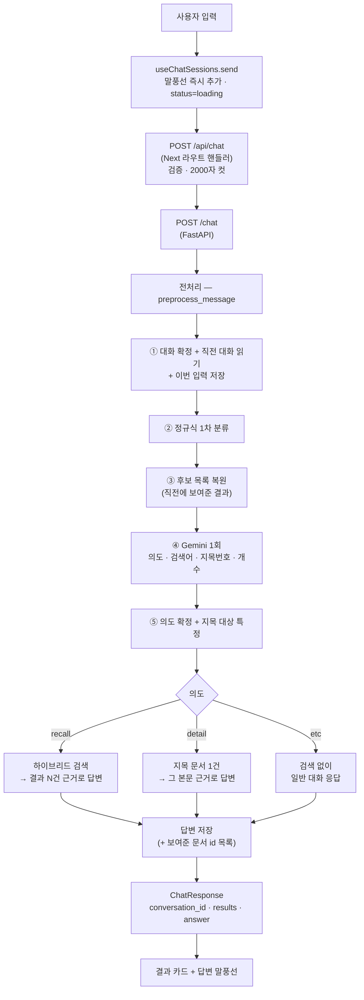
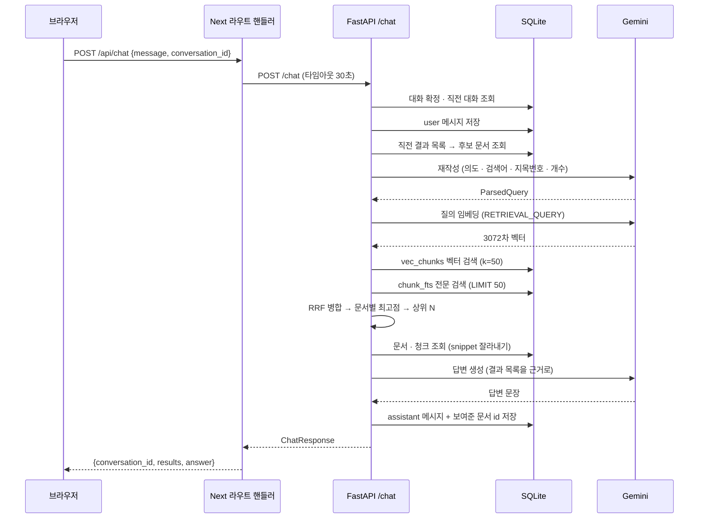
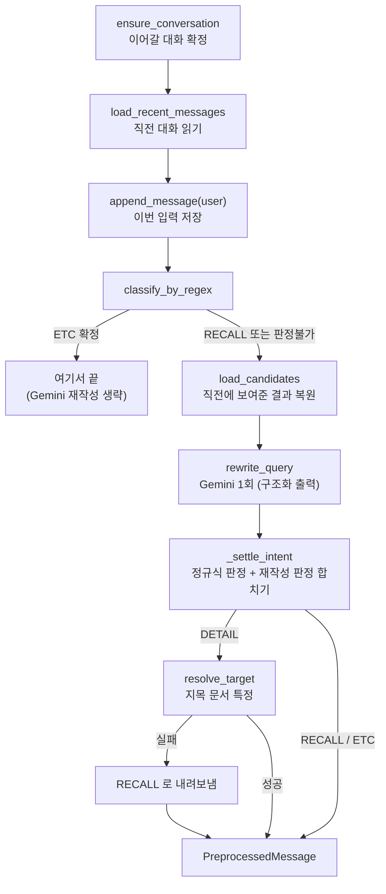
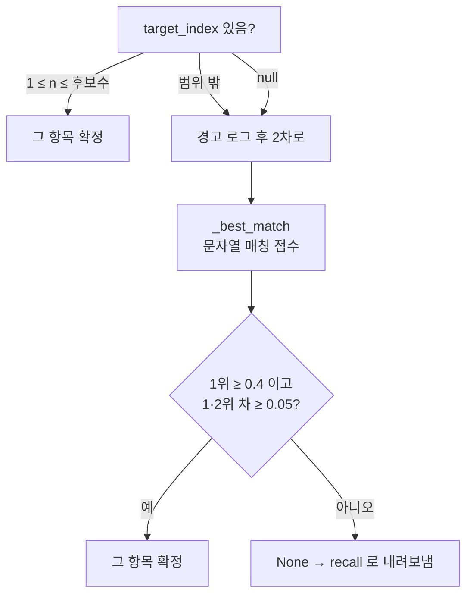
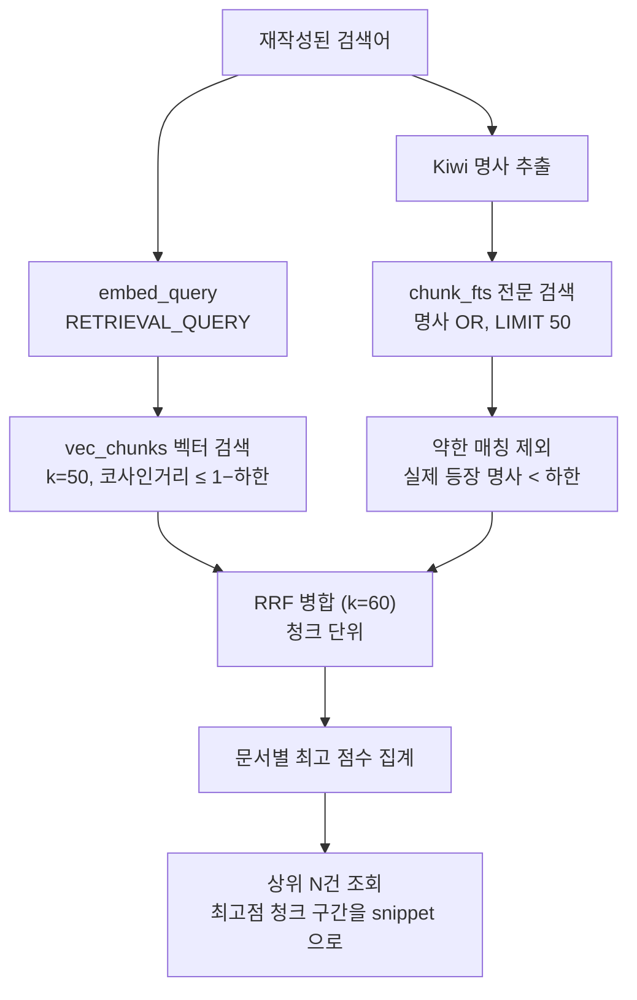

# 질의 처리 흐름

사용자가 채팅창에 질문을 넣은 순간부터 답변과 링크 카드가 화면에 뜨기까지 무엇이 일어나는지
정리한 문서다. 데이터가 쌓이는 쪽은 [`collection-pipeline.md`](collection-pipeline.md)에 있다.

관련 파일:

| 단계 | 파일 |
| --- | --- |
| 입력 · 세션 상태 | `frontend/src/hooks/useChatSessions.ts`, `components/chat/ChatInput.tsx` |
| 클라이언트 ↔ 백엔드 경계 | `frontend/src/app/api/chat/route.ts`, `frontend/src/lib/backend.ts` |
| 진입점 | `api/routes/chat.py` |
| 전처리(대화 · 의도 · 재작성) | `services/preprocess.py`, `services/intent.py`, `services/query_parser.py` |
| 지목 대상 특정 | `services/detail.py` |
| 검색 | `services/search.py`, `services/embedding.py`, `services/tokenizer.py` |
| 답변 생성 | `services/answer.py` |
| 대화 저장 | `services/conversation.py` |

## 한눈에 보기



한 턴에서 **Gemini는 최대 3번** 불린다 — 전처리의 재작성 1회, `recall`이면 질의 임베딩 1회,
답변 생성 1회. 어느 갈래로 가느냐에 따라 줄어든다([호출 횟수](#gemini-호출-횟수) 참고).

## 한 턴의 시간축 (recall)



---

## 0단계 — 클라이언트

### 화면의 세션과 백엔드의 대화는 별개다

사이드바의 세션은 프론트가 `crypto.randomUUID()`로 만든 자체 id로 관리하고, 백엔드
`conversation_id`는 `conversationIdsRef`(`Map<세션id, conversation_id>`)에 따로 들고 있다.

```
사이드바 세션 (프론트 id)          백엔드 대화 (conversation_id)
  "새 대화" ─────────────── (없음)   ← 첫 메시지를 보내야 생긴다
  "리액트 상태관리 …" ────── 3f2a…
  "쿠버네티스 …" ────────── 91bc…
```

첫 메시지를 보내기 전 세션(draft)은 백엔드에 존재하지 않는다. 그래서 이름 바꾸기·삭제도
로컬 상태만 건드리고 API를 부르지 않는다. 답변을 받으면 응답의 `conversation_id`를 그 세션에
매핑해 두고, 다음 요청부터 실어 보내 대화가 이어진다.

전송은 낙관적이다. 사용자 말풍선을 먼저 그려놓고(`status: "loading"`) 요청을 보내며, 같은
세션에 요청이 이미 떠 있으면 새 전송을 막는다. 중지 버튼은 `AbortController`로 끊고, 응답이
돌아와도 그 사이 무효화된 요청이면(`abortsRef.get(id) !== controller`) 화면에 반영하지 않는다.

### 라우트 핸들러가 하는 일

`/api/chat`은 단순 프록시가 아니라 경계 검증을 맡는다.

| 검사 | 실패 시 |
| --- | --- |
| 본문이 JSON인가 | `400` |
| `message`가 문자열이고 비어 있지 않은가 | `400` |
| `conversation_id`가 문자열 또는 없음이고 100자 이하인가 | `400` |
| — | `message`는 앞뒤 공백을 지우고 **2000자로 자름** |

백엔드 호출은 `lib/backend.ts`가 맡고 **30초 타임아웃**이 걸려 있다(라우트 자체는
`maxDuration = 60`). 백엔드가 죽었을 때 `502`, 사용자가 중단하면 `499`로 조용히 끝낸다.

응답을 받으면 이 경계에서 **`document_id`·`score`·`snippet`을 버린다.** 화면 카드에는
`title`과 `url`만 쓰기 때문이다. 제목이 빈 문서는 링크 텍스트가 사라지지 않게 URL로 대체한다.

---

## 1단계 — 전처리 (`preprocess_message`)

검색이나 답변을 시작하기 전에 대화 처리·의도 판단·질의 재작성을 여기서 한 번에 끝낸다.
결과는 `PreprocessedMessage` 하나로, 이후 단계는 원문 대신 이 값을 보고 움직인다.



### 읽는 순서가 먼저, 저장이 나중

```python
history = load_recent_messages(conversation_id, db)   # 먼저 읽고
append_message(conversation_id, MessageRole.USER, message, db)   # 그다음 저장
```

순서가 뒤집히면 `history`에 이번 입력이 포함되어, 모델에게 "직전까지의 대화"가 아니라
같은 문장이 두 번 들어간 맥락을 주게 된다.

`ensure_conversation`은 클라이언트가 보낸 id를 그대로 믿고 행을 만들지 않는다. 모르는 id면
경고를 남기고 **새 대화를 열어** 그 id를 응답에 담는다. 클라이언트가 매 응답의
`conversation_id`로 갱신하면 저절로 복구된다.

`history`에는 두 상한이 함께 걸린다.

| 설정 | 기본값 | 뜻 |
| --- | --- | --- |
| `CHAT_HISTORY_MESSAGES` | `30` | 최근 몇 건까지 볼지 |
| `CHAT_HISTORY_MAX_CHARS` | `8000` | 그 합계 글자 수 상한 |

건수만으로는 프롬프트 크기가 정해지지 않는다 — 긴 글을 붙여넣은 턴이 몇 건 섞이면 같은
30건도 수만 자가 된다. 글자 예산은 최신 건부터 채우다가 넘치는 메시지를 만나면 **거기서
멈춘다**. 그 한 건만 건너뛰고 더 오래된 것을 채우면 대화 중간이 빈 채로 이어져, 맥락을 주기는
커녕 없던 흐름을 지어내게 된다.

### ② 정규식 1차 분류

Gemini를 부르기 전에 확실한 것만 값싸게 가른다(`intent.py`).

| 패턴 | 예 | 판정 |
| --- | --- | --- |
| 빈 문자열 | `""` | `ETC` |
| 기록 관련 키워드 | 찾아, 검색, 북마크, 방문 기록, url, 링크 줘 … | `RECALL` |
| 회상 표현 + 대상 명사 | "어제 **봤던** 그 **블로그**" | `RECALL` |
| 인사·감탄만 | "안녕", "ㅋㅋ", "고마워" | `ETC` |
| 그 외 | "리액트 상태관리 어떻게 했었지" | `None` (판정 불가) |

**정규식은 `DETAIL`을 절대 내지 않는다.** "찾아줘" 같은 표현은 새로 찾는 질문과 이미 찾아준
결과를 캐묻는 질문에 똑같이 붙어서, 앞선 대화를 봐야 갈리기 때문이다.

`ETC`로 확정되면 여기서 끊고 재작성 호출을 건너뛴다. 잡담은 검색을 타지 않으니 재작성할 것이
없고, 그만큼 Gemini 호출 한 번을 아낀다.

### ③ 후보 목록 복원

"두 번째 것"을 풀려면 **그 목록이 무엇이었는지**를 알아야 한다. 그런데 저장된 assistant
메시지의 `content`에는 답변 문장만 있고 제목이 실리지 않은 턴도 있어, 대화 내용만으로는
되짚을 수 없다. 그래서 색인 단계와 별개로 `messages.result_document_ids`에 보여준 순서대로
문서 id를 남겨둔다.

```
history 를 뒤에서부터 훑어 result_document_ids 가 있는 첫 assistant 턴을 찾는다
        │
        ▼
  ["d3…", "a7…", "f1…"]   ← 보여준 순서 그대로
        │
        ▼
  documents 조회 → 순서를 지켜 후보 리스트로 (사라진 문서는 빠진다)
```

`history` 안에서만 찾는 것이 중요하다. 재작성 호출이 맥락으로 보는 범위와 후보 목록의 범위를
일치시키기 위한 것으로, 한참 전 턴의 목록을 후보로 세우면 **사용자 화면에 없는 것**을
"두 번째 것"으로 집게 된다.

### ④ 재작성 호출 — 네 가지를 한 번에

`rewrite_query`는 Gemini 구조화 출력으로 다음을 한 번에 받는다.

```python
class ParsedQuery(BaseModel):
    intent: Intent              # recall | detail | etc
    target_index: int | None    # detail 이면 지목한 항목의 1-based 번호
    query: str                  # 검색 엔진에 넣기 좋게 다듬은 검색어
    desired_count: int | None   # "3개만" 처럼 개수를 말했으면 그 숫자
```

**필드 순서가 곧 추론 순서다.** 이 클래스는 그대로 응답 스키마로 전달되어 `propertyOrdering`이
되므로, `intent`를 먼저 두면 의도를 정하고 그에 맞는 검색어를 쓰게 된다. `target_index`가
`query`보다 앞인 것도 같은 이유다 — 지목한 대상을 먼저 정해야 그 제목을 검색어로 쓸 수 있다.

의도 판단과 검색어 재작성을 **한 호출로 묶은 이유**는 둘이 같은 추론이기 때문이다. "그거
뭐였지"가 무엇을 가리키는지 찾는 일과 이 턴이 `recall`인지 판단하는 일은 분리할 수 없다. 그래서
의도 분류에도 대화 맥락이 필요하고, 그 맥락을 들고 있는 곳이 바로 이 호출이다.

모델에 넘기는 `contents`는 세 덩이다.

```
[user]   과거 대화 …                    ← history 를 멀티턴으로 옮김
[model]  과거 답변 …                       (assistant 로 시작하면 앞쪽은 버림 —
[user]   과거 대화 …                        Gemini 는 user 발화로 시작하길 기대한다)
[model]  과거 답변 …
   ⋮
[user]   직전에 보여준 결과 목록:        ← 후보를 번호 붙여 별개 발화로 끼움
         1. 제목 (url)
         2. 제목 (url)
         3. 제목 (url)
[user]   이번 입력                       ← 판단 대상은 항상 이 마지막 메시지
```

후보 목록을 별개 발화로 두는 것은 "판단 대상은 마지막 사용자 메시지"라는 지시를 흐리지 않기
위해서다. 응답이 스키마로 파싱되지 않으면 `ETC`로 눕혀 일반 대화로 답한다 — 의도조차 못 받은
상황에서 검색으로 밀어봐야 원문 그대로 찾는 헛질의가 된다.

### ⑤ 의도 확정 (`_settle_intent`)

정규식 판정과 재작성 판정을 합친다.

| 정규식 | 재작성 | 후보 있음? | 확정 | 왜 |
| --- | --- | --- | --- | --- |
| — | `detail` | 없음 | **`recall`** | 지목할 목록이 없으면 상세 요청이 될 수 없다 |
| `recall` | `detail` | 있음 | `detail` | 정규식은 이 둘을 못 가리므로 재작성의 세분화를 받는다 |
| `recall` | `etc` | — | **`recall`** | 정규식이 확신한 '기록 관련'은 잡담으로 뒤집지 않는다 |
| `recall` | `recall` | — | `recall` | |
| `None` | 그대로 | — | 재작성 판정 | |

즉 정규식이 `RECALL`이라고 본 턴은 절대 `ETC`로 떨어지지 않고, `detail`이라는 **세분화만**
받아들인다.

### ⑤ 지목 대상 특정 (`resolve_target`)

`detail`로 확정되면 후보 중 어느 것인지 한 건을 골라야 한다. 두 단계다.



**1차(번호)** 는 재작성 호출이 후보 목록을 보고 고른 번호다. 순서("두 번째"), 제목의 일부
("쿠버네티스 그거"), 사이트 이름("velog에서 본 거")이 전부 한 번의 추론으로 풀리고, `detail`
판정을 위해 어차피 부르는 호출이라 비용도 늘지 않는다.

**2차(문자열 매칭)** 는 번호가 없거나 범위를 벗어났을 때의 보루다. 재작성 응답 파싱이 실패한
경로도 여기로 온다. 점수는 `제목 + URL`을 대상으로 0~1로 매긴다.

```
질의를 정규화한 문자열이 "제목 + URL"에 그대로 들어 있으면        → 1.0
그 외에는 다음 둘 중 큰 값
   ├─ coverage    = (질의 낱말 ∩ 문서 낱말) / 질의 낱말 수
   └─ similarity  = SequenceMatcher 비율 × 0.8
```

낱말은 Kiwi로 뽑은 명사 + 영문·숫자 낱말이다. 조사·어미가 붙는 한국어에서는 낱말 겹침이
문자열 유사도보다 잘 맞고, 유사도 쪽은 제목이 길수록 값이 낮게 나와 나란히 두기 위해 0.8을
곱해 깎는다.

두 단계가 모두 실패하면 **아무거나 고르지 않고 `recall`로 내려보낸다.** 엉뚱한 문서를 근거로
그럴듯하게 답하는 것이 가장 나쁜 실패라, 그럴 바엔 기록을 새로 뒤지는 쪽이 낫다는 판단이다.
동점(1·2위 차 0.05 미만)도 실패로 본다 — 그 상태에서 고르는 것은 찍는 것과 같다.

---

## 2-A단계 — `recall`: 하이브리드 검색



### 두 검색

| | 벡터 검색 | 전문 검색 |
| --- | --- | --- |
| 대상 테이블 | `vec_chunks` (vec0) | `chunk_fts` (FTS5) |
| 질의 변환 | Gemini 임베딩, `task_type="RETRIEVAL_QUERY"` | Kiwi 명사 추출 → `OR` 결합 |
| 개수 제한 | `k = 50` | `LIMIT 50` |
| 정렬 | 코사인 거리 오름차순 | `rank`(BM25) 오름차순 |
| 컷오프 | `distance ≤ 1 − MIN_COSINE_SIMILARITY` (SQL에서) | 명사 실제 등장 수 < `MIN_FTS_MATCHED_TERMS` 제외 (파이썬에서) |

색인 때와 **`task_type`이 다르다**(`RETRIEVAL_DOCUMENT` ↔ `RETRIEVAL_QUERY`). 같은 모델이라도
질의와 문서를 다른 방향으로 임베딩하는 편이 검색 품질에 유리하다.

FTS 쪽 사후 필터가 필요한 이유는 `OR` 질의는 명사 하나만 걸려도 히트하기 때문이다. 그래서 결과
본문을 다시 보고 몇 개나 실제로 등장했는지 세어 약한 매칭을 떨어낸다. 기준은
`min(MIN_FTS_MATCHED_TERMS, 명사 수)` — 명사가 하나뿐인 질의가 설정값 때문에 통째로 막히지
않게 한다.

한국어에서 Kiwi를 쓰는 이유는 조사다. FTS5 기본 토크나이저에 "상태관리를"을 그대로 넣으면
"상태관리"가 든 문서와 매칭되지 않는다.

### RRF 병합

두 검색은 점수 스케일이 전혀 다르다(코사인 거리 vs BM25 rank). 값을 정규화해 섞는 대신
**순위만** 본다.

```
청크마다   score = Σ  1 / (60 + rank)
                 각 목록

예) 어떤 청크가 벡터 1위, FTS 3위
      1/(60+1) + 1/(60+3) = 0.01639 + 0.01587 = 0.03226

    벡터 1위에만 있는 청크
      1/(60+1)                       = 0.01639

    FTS 1위에만 있는 청크
                 1/(60+1)            = 0.01639
```

`k = 60`은 상수다. 값이 크면 상위권과 하위권의 점수 차가 완만해져, 한쪽에서만 1위인 청크가
양쪽에서 중위권인 청크를 압도하지 못하게 된다.

### 청크 점수 → 문서 순위

RRF는 청크 단위로 나오지만 사용자에게 보여주는 것은 문서다.

```
청크 점수                        문서 점수
D1:0  0.0163  ┐
D1:2  0.0323  ├─ 최고값 채택 →   D1  0.0323  (대표 청크 seq=2)
D1:5  0.0161  ┘
D2:1  0.0246  ───────────────→   D2  0.0246  (대표 청크 seq=1)
                                      │
                          점수 내림차순 상위 N건
```

합산이 아니라 **최고값**을 쓴다. 합산하면 긴 문서(청크가 많은 문서)가 조금씩 걸린 것만으로
위로 올라간다.

그리고 최고 점수를 낸 그 청크의 `char_start`~`char_end`로 `documents.full_text`를 잘라
`snippet`으로 싣는다. 즉 **발췌는 질문과 가장 잘 맞은 대목**이다. 청크 하나가 약 8192자이므로
발췌도 그만큼 길 수 있다.

`N`은 `desired_count`("3개만 찾아줘")가 있으면 그 값, 없거나 0 이하면 기본 `5`다. 매칭이 하나도
없으면 빈 배열을 돌려준다.

### 답변 생성

```
사용자 질문: {원문 그대로}

검색된 기록:
- 제목 (url)
  본문 발췌: …
- 제목 (url)
  본문 발췌: …
```

프롬프트에 들어가는 질문은 **재작성된 검색어가 아니라 사용자가 실제로 입력한 원문**이다.
재작성 결과는 검색에만 쓴다. 시스템 지시는 "이 목록만 근거로 답하고, 목록에 없는 내용은
지어내지 말고, 목록이 비어 있으면 관련 기록을 찾지 못했다고 답하라"다.

---

## 2-B단계 — `detail`: 지목한 문서 하나

검색을 **다시 타지 않는다.** 특정해 둔 그 문서가 아닌 것이 위로 올라오면 지목이 무의미해지기
때문이다. `desired_count`도 이 경로에서는 뜻이 없다.

```
results = [ 지목된 문서 1건 ]
              score   = 1.0        ← 순위가 아니라 '직접 지목됨'을 뜻하는 값
              snippet = 본문 앞 300자
```

답변 근거는 발췌가 아니라 **본문**이다. "자세히 알려줘"에 답하려면 발췌로는 부족하다.

```
사용자 질문: {원문}

지목된 기록
제목: …
URL: …
본문:
{full_text[:DETAIL_MAX_CHARS]}

(본문이 길어 앞 20000자만 실었다. 이 뒤의 내용은 알 수 없다.)   ← 잘렸을 때만
```

잘렸다는 사실을 함께 알리는 이유는, 뒤가 더 있다는 것을 모르면 실린 앞부분이 문서의 전부인 줄
알고 "그런 내용은 없다"고 단정하기 때문이다. 질문과 맞물리는 구간을 골라 싣는 것은 청크 검색이
필요한 별개 과제라, 지금은 앞에서부터 자른다.

본문이 비어 있으면 **Gemini를 부르지 않고** 고정 문구로 답한다. 제목만 주면 그럴듯한 내용을
지어내기 때문이다.

> `'{제목}' 기록은 제목과 주소만 남아 있어 본문 내용을 알려드릴 수 없습니다.`

시스템 지시도 `recall`과 다르다. 근거가 목록이 아니라 본문 하나라서, 실패 답변이 "목록에서 못
찾았다"가 아니라 "그 기록에는 그 내용이 없다"여야 옳다.

---

## 2-C단계 — `etc`: 검색 없음

`results`는 빈 배열이고, 원문만 넣어 일반 대화 응답을 만든다. 시스템 지시는 "친절하고 간결한
한국어로, 확실하지 않은 사실은 지어내지 말고 모른다고 답하라"뿐이다.

---

## 3단계 — 저장과 응답

답변을 만들고 나면 assistant 메시지를 저장하는데, 이때 **그 턴이 보여준 문서 id 목록**을 함께
남긴다. 다음 턴의 "두 번째 것"을 풀 근거가 이 값이다.

| 의도 | `results` | 저장되는 `result_document_ids` |
| --- | --- | --- |
| `recall` | 검색 결과 N건 | 그 N건의 id (없으면 `NULL`) |
| `detail` | 지목된 1건 | **`NULL` — 갱신하지 않음** |
| `etc` | `[]` | `NULL` |

`detail` 턴이 목록을 갱신하지 않는 것이 핵심이다. 이 턴은 새 목록을 보여준 것이 아니라 이미
보여준 목록에서 하나를 설명한 턴이다. 지목된 한 건으로 갈아치우면 **"아니, 세 번째 것"** 같은
연속 지목이 막힌다. 빈 목록을 `NULL`로 눕혀 저장하므로, 후보를 찾을 때 "결과가 있던 마지막 턴"이
그대로 걸린다.

```
턴 1  recall  → 5건 보여줌      result_document_ids = [a,b,c,d,e]
턴 2  detail  → b 설명          result_document_ids = NULL   ← 후보는 여전히 턴 1
턴 3  detail  → "세 번째 것"     후보 목록에서 c 를 집는다 ✓
```

응답은 이렇게 나간다.

```json
{
  "conversation_id": "3f2a…",
  "results": [
    { "document_id": "d3…", "url": "https://…", "title": "…", "score": 0.0323, "snippet": "…" }
  ],
  "answer": "어제 보신 글은 …"
}
```

---

## Gemini 호출 횟수

| 경로 | 재작성 | 질의 임베딩 | 답변 | 합계 |
| --- | --- | --- | --- | --- |
| 정규식이 `ETC`로 확정 | — | — | 1 | **1** |
| `etc` (재작성 판정) | 1 | — | 1 | **2** |
| `recall` | 1 | 1 | 1 | **3** |
| `detail` | 1 | — | 1 | **2** |
| `detail`이나 본문이 빈 문서 | 1 | — | — | **1** |
| `detail` → `recall` 강등 | 1 | 1 | 1 | **3** |

프론트 타임아웃 30초 안에 이것이 전부 순차로 일어난다. 스트리밍이 아니므로 답변이 다 만들어질
때까지 화면에는 로딩 상태만 보인다.

## 폴백 정리

무언가 실패했을 때 어디로 떨어지는지 한자리에 모았다.

| 상황 | 처리 |
| --- | --- |
| 모르는 `conversation_id` | 새 대화를 열고 그 id를 응답에 담음 |
| 재작성 응답이 스키마로 파싱 안 됨 | `etc`로 눕혀 일반 대화 응답 |
| 재작성이 `detail`인데 후보 목록이 없음 | `recall` |
| `target_index`가 범위를 벗어남 | 경고 후 문자열 매칭으로 |
| 문자열 매칭 1위가 0.4 미만 | `recall` |
| 문자열 매칭 1·2위가 0.05 이내 접전 | `recall` |
| 검색 결과 0건 | `results: []` + "찾지 못했다"는 답변 |
| 검색이 집은 문서가 이미 삭제됨 | 경고 로그 남기고 그 건만 건너뜀 |
| `detail` 대상의 본문이 비어 있음 | Gemini 없이 고정 문구 |
| 백엔드 연결 실패·타임아웃 | 라우트 핸들러가 `502` + 안내 문구 |
| 사용자가 중지 | `499`, 말풍선 추가하지 않음 |

## 알려진 한계

- **지목 후보는 프롬프트에 실린 범위 안의 것뿐이다.** `CHAT_HISTORY_MESSAGES`·
  `CHAT_HISTORY_MAX_CHARS`보다 앞선 턴에서 보여준 결과는 "두 번째 것"으로 집을 수 없다.
- **과거 대화를 다시 열면 결과 카드가 복원되지 않는다.** assistant 메시지에는 답변 문장만
  저장되고 `title`/`url`은 남지 않아, 사이드바에서 불러온 대화의 답변은 텍스트만 보인다
  (지목에 쓰이는 `result_document_ids`는 서버 안에서만 쓰인다).
- **색인하지 않은 문서는 검색되지 않는다.** `/batch`를 돌려야 `vec_chunks`/`chunk_fts`에 들어간다.
- **발췌 선택이 거칠다.** `recall`의 `snippet`은 최고점 청크 구간(최대 약 8192자)이고,
  `detail`의 근거는 본문 앞 `DETAIL_MAX_CHARS`자다. 둘 다 질문에 맞춰 구간을 고르지는 않는다.
- **스트리밍이 없다.** 답변이 완성될 때까지 기다린다.
- **`score`는 클라이언트에 도달하지 않는다.** 라우트 경계에서 버려지므로 화면에서 순위 근거를
  볼 수 없다.

## 관련 문서

- [`README.md`](../README.md) — 전체 구성, 환경변수, 의도 분류 요약
- [`collection-pipeline.md`](collection-pipeline.md) — 수집 · 색인 파이프라인
- [`conversations-api.md`](conversations-api.md) — 대화 목록 · 조회 · 이름변경 · 삭제 API
